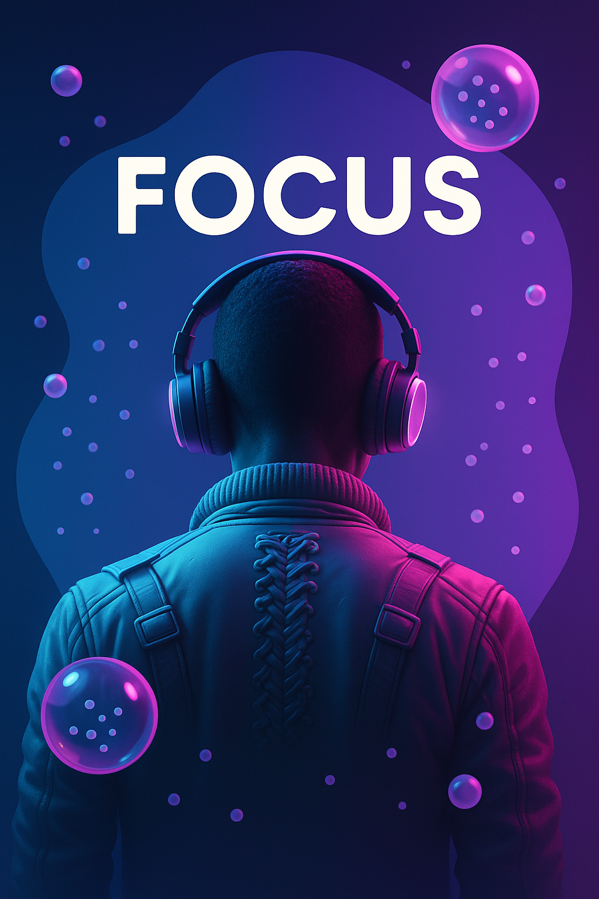

# 🎯 Fokus - App de Enfoque y Productividad

 <!-- Reemplaza con tu imagen de preview -->

Aplicación web para mejorar la concentración mediante temporizador Pomodoro adaptable, con música ambiental y seguimiento de sesiones.

## 🚀 Características Principales

- **3 Modos de Temporizador:**
  - 🧠 Enfoque (25 minutos)
  - ☕ Descanso Corto (5 minutos)
  - 🌴 Descanso Largo (15 minutos)
- 🎵 Música ambiental relajante (activable/desactivable)
- 🔔 Sonidos de notificación para transiciones
- 🎨 Temas visuales dinámicos según modo
- 📱 Diseño responsive (funciona en móviles y tablets)
- ⏯️ Control de pausa/reinicio

## 🛠️ Tecnologías Utilizadas

## 📦 Instalación

1. Clona el repositorio:
   
   git clone https://github.com/tu-usuario/fokus-app.git

2. Abre en tu navegador:

   
   cd fokus-app && open index.html
   

## 🎮 Cómo Usar

1. Selecciona un modo:

   * 🧠 Enfoque para sesiones intensivas
   * ☕ Descanso corto para pausas breves
   * 🌴 Descanso largo para recuperación

2. Activa la música ambiental si lo deseas 🎧

3. Presiona ▶️ para iniciar el temporizador

4. Recibirás una notificación sonora al finalizar cada sesión 🔔

## 🌈 Temas Visuales

| Modo           | Colores Principales      |
| -------------- | ------------------------ |
| Enfoque        | Morado / Azul Oscuro     |
| Descanso Corto | Verde / Verde Oscuro     |
| Descanso Largo | Azul Claro / Azul Marino |

## 🤝 Contribuir

Las contribuciones son bienvenidas:

1. Haz Fork del proyecto
2. Crea tu rama (`git checkout -b feature/nueva-funcionalidad`)
3. Commit tus cambios (`git commit -m 'Agrega nueva funcionalidad'`)
4. Push a la rama (`git push origin feature/nueva-funcionalidad`)
5. Abre un Pull Request

## 📄 Licencia

MIT License - ver [LICENSE.md](LICENSE.md) para más detalles.

---

Hecho con ❤️ por \[Tu Nombre] - [¡Visita el sitio en vivo!](https://tu-usuario.github.io/fokus-app)

---

> 💡 **Nota**:
>
> 1. Reemplaza `tu-usuario` con tu nombre de usuario de GitHub
> 2. Agrega tus propias imágenes de preview en la carpeta `imagenes/`
> 3. Personaliza la sección de licencia según tus necesidades
> 4. Agrega enlaces a tu demo en vivo si está deployada

